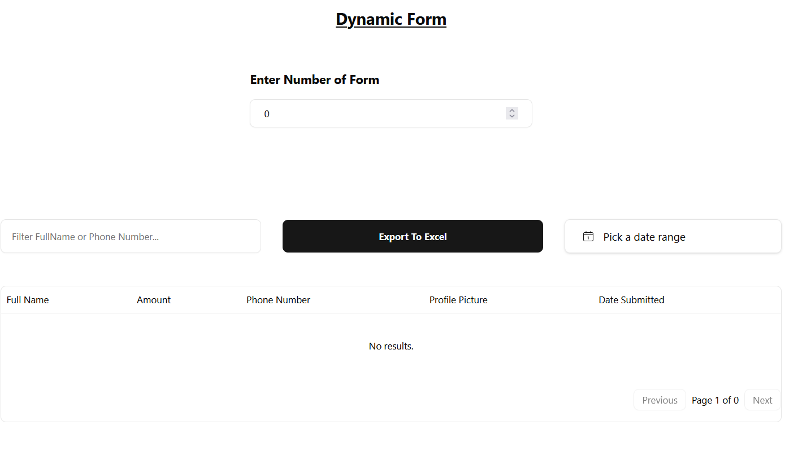
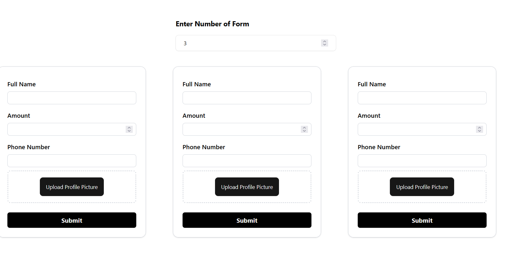
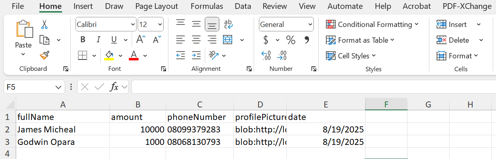

# Records Dashboard

A React + TypeScript application for managing and filtering records. Features include date filtering, profile picture upload, and exporting filtered records to **Excel (.xlsx)** using [SheetJS](https://github.com/SheetJS/sheetjs).

---

## 🚀 Features

- Add and view records  
- Upload profile picture (stored as `File`)  
- Filter records by date range  
- Export filtered records to **Excel (.xlsx)**  
- Responsive table view  

---
## 🚀 Live Demo

[Live Demo](https://nextjs-dynamic-form-record.vercel.app/)

---

## 🖼️ Screenshots

- **Homepage**  


- **Display Dynamic Form**  


- **Export to Excel Sample Image**  


---

## ⚙️ Tech Stack

- React 18  
- TypeScript  
- Tailwind CSS
- [Shadcn](https://ui.shadcn.com/) for customized components  
- [React Hot Toast](https://react-hot-toast.com) for toasts notification
- [React Icons](https://react-icons.github.io/react-icons/) for icons
- [Formik](https://formik.org/) for forms
- [Yup](https://github.com/jquense/yup) for form validation
- [TanStack Table](https://tanstack.com/table) for data tables  
- [SheetJS (xlsx)](https://github.com/SheetJS/sheetjs) for Excel export  

---

## 🔧 Installation & Setup

1. **Clone the repository**

   ```bash
    git clone https://github.com/your-username/records-dashboard.git
    cd records-dashboard
    ```
2. **Install Dependencies** 

    ```bash
    npm install
    or 
    yarn install
    ```
3. **Start Development Server** 

    ```bash
    npm run dev

    ```
    Open http://localhost:3000 in your browser.

## 📝 Usage

1. Input the number of form you want to add records with
2. Add a new record with FullName, Amount, Phone Number, and Profie Picture.  
3. Use the date filter and search filter to narrow records.  
4. Click "Export to Excel" to download filtered records.  
